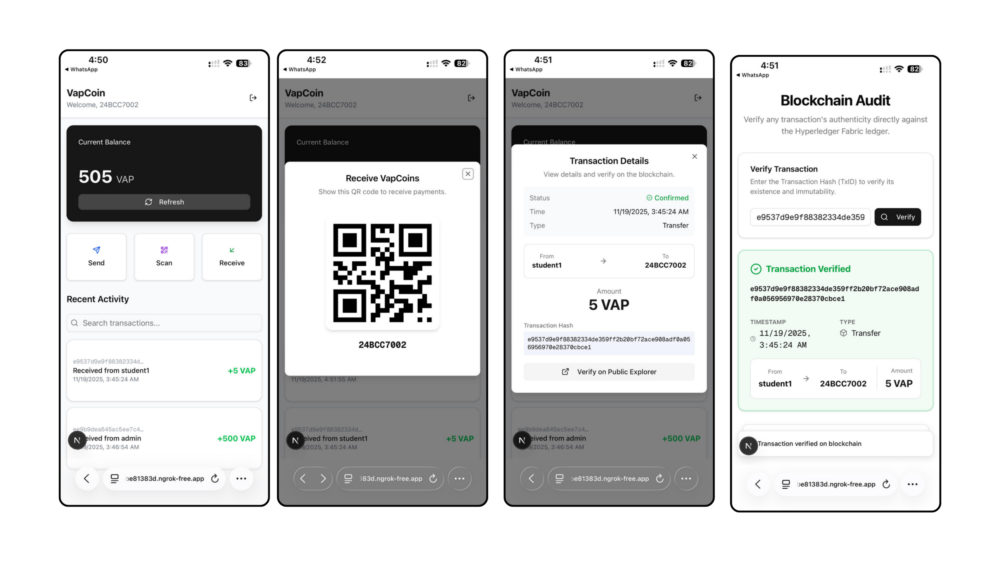
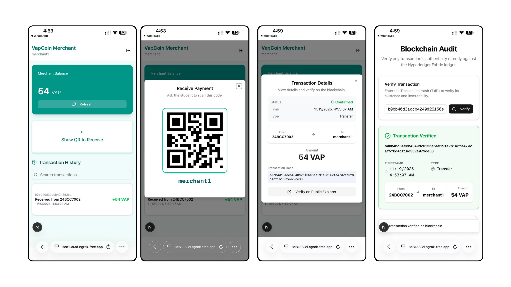
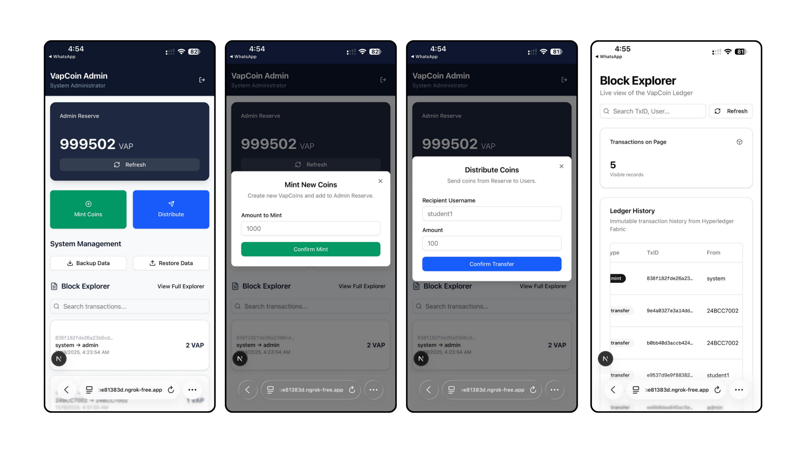
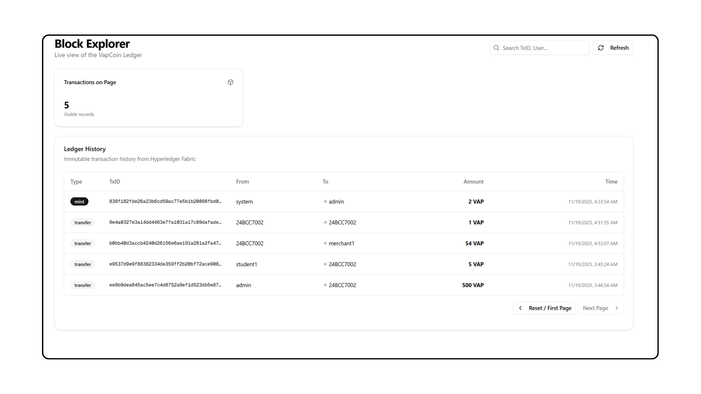

# VapCoin

VapCoin is an enterprise-grade, permissioned blockchain payment solution engineered for university campus environments. Built on **Hyperledger Fabric**, it facilitates secure, real-time, and immutable micro-transactions between students, merchants, and administration, replacing traditional centralized ledgers with a distributed trust model.

## Project Overview

This project represents a "Vertical Slice" MVP designed to validate the application of Distributed Ledger Technology (DLT) in a closed-loop campus economy. By utilizing a permissioned blockchain, VapCoin ensures that every transaction is cryptographically signed, timestamped, and permanently recorded, providing an audit trail that is tamper-proof by design.

## Live Demo

Experience the platform live at: **[https://vapcoin.rkr.cx/](https://vapcoin.rkr.cx/)**

Use the following credentials to explore the system:

| Role | Username | Password |
|------|----------|----------|
| **Student** | `student1` | `password` |
| **Merchant** | `merchant1` | `password` |

## Platform Showcase

### Student Dashboard
*Real-time balance tracking and QR-based payments.*


### Merchant Portal
*Point-of-Sale interface for generating dynamic payment requests.*


### Admin Console
*System management for minting coins and user administration.*


### Blockchain Explorer
*Transparent, immutable ledger view for auditing transactions.*


## Features

### Core Blockchain
- **Hyperledger Fabric v2.5**: Industry-standard permissioned blockchain framework.
- **Smart Contracts (Chaincode)**: Business logic written in Go, enforcing rules for Minting, Transferring, and Querying assets.
- **Immutable Ledger**: Guarantees data integrity and non-repudiation of all financial activities.

### User Roles
- **Students**:
  - View real-time wallet balance.
  - Send payments via QR code scanning or manual ID entry.
  - View personal transaction history.
- **Merchants**:
  - Generate dynamic QR codes for payments.
  - View sales history and daily settlements.
- **Administrators**:
  - Mint new coins into the reserve.
  - Distribute coins to users.
  - Monitor the entire ledger via a Block Explorer.
  - Perform system backups and restoration.

### Transparency
- **Public Verification**: Anyone can verify a transaction's validity using its unique Transaction ID (TxID) without logging in.

## Technology Stack

- **Blockchain**: Hyperledger Fabric, Docker, Go (Chaincode)
- **Backend**: Go (Gin Framework), PostgreSQL (User Data & Auth)
- **Frontend**: Next.js (App Router), TypeScript, Tailwind CSS, Shadcn UI
- **Infrastructure**: Docker Compose

## Getting Started

### Prerequisites
- Docker & Docker Compose
- Go 1.24+
- Node.js 20+
- PostgreSQL

### Installation

1. **Start the Blockchain Network**
   Navigate to the network directory and start the Fabric network.
   ```bash
   cd network
   ./start.sh
   ```

2. **Deploy Chaincode**
   Deploy the smart contract to the channel.
   ```bash
   ./deploy_chaincode.sh
   ```

3. **Setup Backend**
   Navigate to the backend directory, install dependencies, and start the server.
   ```bash
   cd ../backend
   go mod download
   go run main.go
   ```

4. **Setup Frontend**
   Navigate to the frontend directory, install dependencies, and start the development server.
   ```bash
   cd ../frontend
   npm install
   npm run dev
   ```

5. **Access the Application**
   Open your browser and navigate to `http://localhost:3000`.

## License

This project is licensed under the MIT License - see the [LICENSE](LICENSE) file for details.
